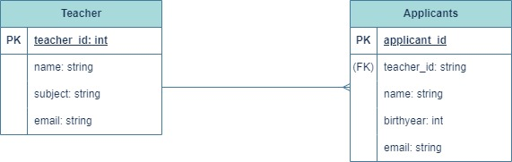

# Project Title: Spring Boot Portal Management System

## Project Overview
This Spring Boot web application integrates Spring Security and Amazon Cognito to provide secure user authentication and authorization. It includes features for user registration, login, and automated deployment using AWS CodePipeline.

### URL to Web Application
[Portal web application](http://localhost:8080)


## Table of Contents
- [Summary](#summary)
- [Database Diagram](#database-diagram)
- [Application Description and Purpose](#application-description-and-purpose)
- [User Functionality with Spring Security and Amazon Cognito](#User-Functionality-with-Spring-Security-and-Amazon-Cognito)
- [Deployment Methods](#deployment-methods)
    - [AWS CodePipeline](#aws-codepipeline)
    - [EC2 Manual Deployment](#ec2-manual-deployment)
- [Comparison of Deployment Methods](#comparison-of-deployment-methods)

### Summary
This project is a Spring Boot web application designed to manage student and teacher data, implementing features such as user registration, login, and CRUD (Create, Read, Update, Delete) operations. It leverages two deployment methods, AWS CodePipeline and Amazon EC2, and provides a comparison of these methods in terms of efficiency, scalability, and control.

### Database Diagram
The application uses a MySQL database with two tables, `Applicant` and `Teacher`, which are related as follows:

- **Applicant**: Contains fields `id`, `name`, `birthYear`, and `email`.
- **Teacher**: Contains fields `id`, `name`, `subject`, and `email`.

- **Relationships**:
    - A one-to-many relationship exists between `Teacher` and `Applicant`, where a teacher can have multiple applicants.




### Application Description and Purpose
The Applicant Management System is designed to allow users to:
- Register and log in.
- Manage (add, edit, delete) student and teacher data.
- Interact with REST API endpoints for easy data handling.

The goal of this project is to demonstrate how to build and deploy a web application using both automated (AWS CodePipeline) and manual (EC2) deployment methods.

### User Functionality with Spring Security and Amazon Cognito
As an Identity Provider, Cognito supports the authorization_code, implicit, and client_credentials grants. For our purposes, let’s set things up to use the authorization_code grant type.
First, we need a bit of Cognito setup:
- Create a User Pool
- Add a User – we’ll use this user to log into our Spring Application
- Create App Client
- Configure App Client
n the configuration of the application client, make sure the CallbackURL matches the redirect-uri from the Spring config file.
- Spring Setup
- Since we want to use OAuth 2.0 Login, we’ll need to add the spring-security-oauth2-client and spring-security-oauth2-jose dependencies to the application:
```xml 
<dependencies>
    <dependency>
        <groupId>org.springframework.boot</groupId>
        <artifactId>spring-boot-starter-oauth2-client</artifactId>
    </dependency>
    <dependency>
        <groupId>org.springframework.security</groupId>
        <artifactId>spring-security-oauth2-jose</artifactId>
        <version>6.3.3</version>
    </dependency>
</dependencies>
````
And then, we’ll need some configuration to bind everything together in yml file:
```yml

security:
oauth2:
client:
registration:
cognito:
user-pool-id: eu-north-1_7FaOkjPV5
client-id: cr75am7mc736ecd9a9ho64qna
region: eu-north-1
redirect-uri: http://localhost:8080
domain: https://admi-user-pool.auth.eu-north-1.amazoncognito.com
provider:
cognito:
issuerUri: arn:aws:cognito-idp:eu-north-1:618550459571:userpool/eu-north-1_7FaOkjPV5
user-name-attribute: user123
````

- Spring Security Configuration
  Now we’ll add a security configuration class:
- Add a Landing Page
  Next the home HTML Thymeleaf landing page so that we know when we’re logged in:
- And then let’s make sure we tie the application root to our welcome page
- Run the App

### Deployment Methods

1. AWS CodePipeline
#### Description
AWS CodePipeline is a fully automated CI/CD service that facilitates continuous delivery by automating the build, test, and deployment phases.

#### Why Chosen
We chose AWS CodePipeline because of its ability to automate the entire deployment process, reducing manual intervention and ensuring quicker updates to the application.

#### Deployment Steps
1. Set up AWS CodePipeline in the AWS console.
2. Connect your GitHub repository to the pipeline.
3. Add a build stage using AWS CodeBuild and a deployment stage using AWS Elastic Beanstalk or EC2.
4. Test the pipeline by pushing code changes to GitHub.
5. Monitor logs for successful build and deployment.

2. EC2 Manual Deployment

#### Description
Amazon EC2 provides scalable virtual servers. With manual deployment, you have full control over the configuration and setup of the environment.

#### Why Chosen
We selected EC2 manual deployment to offer more control over the environment and demonstrate a hands-on approach to server setup.

#### Deployment Steps
1. Build a Spring Boot Application and Upload Code to AWS CodeCommit
2. Add buildspec.yml and appspec.yml
3. Create IAM Roles for CodeDeploy, CodeBuild, and EC2
4. Create an EC2 Instance
5. Create an Application in CodeDeploy
6. Create a Deployment Group
7. Create a New Pipeline
8. Test the Pipeline

#### Video Demonstration

For a demonstration of the application, watch the video below:

[Watch the video](Deployment%20of%20Spring%20Boot%20Application%20Using%20AWS%20CodePipeline.mp4)


### Comparison of Deployment Methods

| **Feature**                   | **AWS CodePipeline**                      | **EC2 Manual Deployment**              |
|-------------------------------|-------------------------------------------|----------------------------------------|
| **Automation**                 | Fully automated CI/CD pipeline            | Requires manual steps, including SSH.  |
| **Ease of Use**                | Easy to set up via a GUI                  | More complex, involves manual configuration |
| **Control**                    | Limited control over deployment stages    | Full control over all environment configurations |
| **Scalability**                | Automatically scales with AWS services    | Requires manual scaling adjustments    |
| **Error Handling**             | Automated error detection and reporting   | Manual error identification            |
| **Deployment Speed**           | Faster due to automation                  | Slower due to manual processes         |
| **Cost**                       | Potentially higher due to additional AWS services | Lower but labor-intensive              |

##### By comparing these deployment methods, we can see that AWS CodePipeline is ideal for fast, automated deployments, while EC2 manual deployment offers more control over configuration, suitable for users who prefer a hands-on approach to server management.